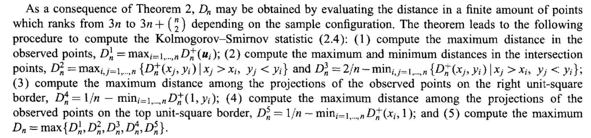

# Simulation Results for the Power of the Multivariate Kolmogorov-Smirnov Test

by David Hamann

## 1 The Theorem and the Algorithm

Let the sample $x_1, \dots, x_n$ of i.i.d. $p$-dimensional random variables with distribution $F$ be given. For the test $H_0 : F = F_0$ against $H_1 : F \neq F_0$,

$$D_n = \max_{j=1,2,\dots} d_n^j$$

is the multivariate version of the Kolmogorov-Smirnov test statistic. Here $d_n^j = \sup_{y^j}|G_n(y^j) - y_1^j \cdots y_p^j|$ and

$$y_1^j = F(z_1^j)$$

$$y_i^j = F(z_i^j \mid z_{i-1}^j, \dots, z_1^j)$$

is the sequence of transformations (Rosenblatt transformation) that generates all $(y_1^j, \dots, y_p^j)$. $(z_1^j, \dots, z_p^j)$ for $j = 1, \dots, p!$ is the $j$-th permutation of $(x_1, \dots, x_p)$.

According to the article by Justel et al., in the two-dimensional case this statistic can be written by means of the following finite set of differences:

$$D_n = \max_{u \in I, v \in P} \{G_n(u) - G(u), \; G(v) - G_n(v^-)\}.$$

Here $I = \{(x_j, y_i) \mid x_i \leq x_j, y_i \geq y_j; \; i, j = 0, 1, \dots, n\}$ and $P = \{(x_j, y_j) \mid x_j > x_i, y_j < y_i; \; i, j = 0, 1, \dots, n+1\}$, $G$ is the distribution function of two independent random variables uniformly distributed between 0 and 1, and $G_n$ is the empirical distribution function. $I$ is the set consisting of the point $(0,0)$ and the intersection points $(x_j, x_i)$ for $x_i < x_j$ and $y_i > y_j$. $P$ is the set consisting of the point $(1,1)$, the intersection points, and the projections of the observed points onto the right and the upper boundary of the unit square.

Figure 1 gives the description of the algorithmic implementation of these finite differences from the article.



**Figure 1: Description of the algorithm in the article**


Here $D_n^+(u) = (G_n(u) - G(u))$ and $D_n^-(u) = (G(u) - G_n(u))$. Figure 2 (see appendix) is the algorithm described in the article, implemented in Python. Here `empirical_cdf` is the two-dimensional empirical distribution function, `G_uniform` the distribution function of the two-dimensional uniform distribution on 0 and 1, and `ks_2d_statistic` the two-dimensional Kolmogorov-Smirnov test statistic as described above.

`D1` through `D5` in the code correspond directly to $D_n^1$ through $D_n^5$ from the description of the algorithm in Figure 1.

## 2 Monte Carlo Simulation

For a given sample, the test statistic $D_n$ can be computed. This statistic can then be compared with the percentiles of the true distribution of $D_n$ in order to reach a decision regarding the hypotheses. The percentiles of the distribution of $D_n$ can be approximated by means of Monte Carlo simulation, since there is no closed/analytical form. Figure 3 (see appendix) shows the code for the implementation of the Monte Carlo simulation for $n = 15$ and $\alpha = 0.05$.

A comparison of the results of the Monte Carlo simulation for 2000 runs is given in Table 1:

| $n$ | MC percentile values (Justel et al.) | own MC percentile values |
| --- | --- | --- |
| 15 | 0.4141 | 0.4118 |
| 25 | 0.3254 | 0.3277 |
| 50 | 0.2350 | 0.2350 |
| 100 | 0.1675 | 0.1663 |

**Table 1: Comparison of MC simulation values**

The absolute deviation of the simulations is of the order of magnitude $10^{-3}$. This lies within the range of deviation that is to be expected.

## 3 Simulation of the Goodness-of-Fit Test

Various simulation results are presented in the article. Among them are results in which the two-dimensional Kolmogorov-Smirnov test statistic is used in the context of a goodness-of-fit test for normality. As $H_0$, the bivariate normal distribution with $\mu = 0$ and covariance matrix

$$\Sigma = \begin{pmatrix} 1 & 0.5 \\ 0.5 & 1 \end{pmatrix}$$

is considered. The alternative distribution is the Gaussian mixture distribution $(1 - \varepsilon)N_2(0, \Sigma) + \varepsilon N_2(\mu, \Sigma)$ for $\varepsilon \in \{0.1, 0.2, 0.4\}$ and $\mu = (3,3)^T$. Since the distribution under $H_0$ is known, one can sample data points $x_1, \dots, x_n$ from the mixture distribution and transform them by means of the Rosenblatt transformation as follows:

$$u_1 = F_0(x_1)$$

$$u_i = F_0(x_i \mid x_{i-1}, \dots, x_1).$$

With the points $u_1, \dots, u_n$ obtained from this, the Kolmogorov-Smirnov test statistic $D_n = \sup_{u \in [0,1]^2}|G_n(u) - \prod u_i|$ can be computed using the `ks_2d_statistic` function (see appendix, Figure 2). Since under $H_0$

$$(X_1, X_2) \sim \mathcal{N}(0, \Sigma)$$

holds, it follows that $X_1 \sim \mathcal{N}(0,1)$ and $F_1(x_1) = \Phi(x_1)$. Since $X_2 \mid X_1$ is also normally distributed, it follows that $X_2 \mid X_1 = x_1 \sim \mathcal{N}(0.5x_1, 0.75)$, hence $F_2(X_2 \mid X_1) = \Phi\!\left(\frac{X_2 - 0.5X_1}{\sqrt{0.75}}\right)$, since $E[X_2 \mid X_1 = x_1] = 0.5x_1$ and $\mathrm{Var}(X_2 \mid X_1) = 1 - 0.5^2 = 0.75$.

The implementation of the goodness-of-fit test with 10,000 runs for $n = 15$ of the Gaussian mixture mentioned above can be seen in Figure 4 (see appendix).

An alternative implementation of the mixture is shown in Figure 5 (see appendix).

A comparison of the simulation results of the article and my simulation results can be seen in Table 2. The two power values from my simulation are the result of two different runs, each with 10,000 replications of computing the power from samples of the Gaussian mixture (`num_sim` = 10,000). In order to reproduce the results of the article as accurately as possible, and since the Monte Carlo simulated $D_n$ percentiles hardly differ, I used the percentile values of the article for the simulation of the power. The deviation in the power between the runs of my simulation lies in the range of $10^{-3}$, with a maximum deviation of 0.01. These deviations are to be explained by the variation of the sampling. The difference between the power values in the article and my values, however, amounts to up to 0.06 and thus points very clearly to a systematic error. Especially so, since the replication of my own simulation suggests the range in which a power not systematically deviating would lie. A general trend of the values of the article is nevertheless also visible in my results: with larger $\varepsilon$ and increasing sample size, the power increases. The incremental differences in the power under changes of $\varepsilon$ and $n$ are also very similar to the values of the article; for example, in the article the power for $n = 15$ and $\varepsilon = 0.1$ differs from the power for $n = 15$ and $\varepsilon = 0.2$ by 0.14. In my simulations the difference is 0.1315 and 0.1217 respectively.

Despite the systematic deviation, my power simulations nevertheless appear plausible, and the change under variation of $n$ and $\varepsilon$ is likewise preserved.

In the search for errors I checked the following potential sources of error. In addition to the variant described above, I recomputed the Rosenblatt transformation using the definition of the conditional density, compared the algorithm for the test statistic against the description in the article several times, and searched for errors of my own in the code. Furthermore, I implemented a second variant of a Gaussian mixture (see Figures 4 and 5).

| $n$ | $\varepsilon$ | Power (Justel et al.) | Power (own values) |
| --- | --- | --- | --- |
| 15 | 0.1 | 0.13 | 0.0817 / 0.0918 |
| 15 | 0.2 | 0.27 | 0.2132 / 0.2135 |
| 15 | 0.4 | 0.73 | 0.6738 / 0.6706 |
| 25 | 0.1 | 0.16 | 0.1155 / 0.112 |
| 25 | 0.2 | 0.40 | 0.335 / 0.335 |
| 25 | 0.4 | 0.92 | 0.8899 / 0.8863 |
| 50 | 0.1 | 0.23 | 0.177 / 0.1712 |
| 50 | 0.2 | 0.67 | 0.6027 / 0.5984 |
| 50 | 0.4 | 1 | 0.996 / 0.9958 |
| 100 | 0.1 | 0.41 | 0.3198 / 0.3119 |
| 100 | 0.2 | 0.94 | 0.9216 / 0.9176 |
| 100 | 0.4 | 1 | 1 / 1 |

**Table 2: Comparison of the simulated power values**

## A Appendix

```python
def empirical_cdf(x, y, X, Y):
    return np.mean((X <= x) & (Y <= y))

def G_uniform(x, y):
        return x * y

def ks_2d_statistic(X, Y, G):

    n = len(X)
    X = np.clip(X,0,1)
    Y = np.clip(Y,0,1)

    # maximum of observed points
    D1 = max(
        empirical_cdf(X[i], Y[i], X, Y) - G(X[i], Y[i])
        for i in range(n)
    )

    # maximum distance over all intersection points
    D2 = max(
            empirical_cdf(X[j], Y[i], X, Y) - G(X[j], Y[i])
            for j in range(n) for i in range(n)
            if (X[j]>X[i] and Y[j]<Y[i])
        )

    # minimum distance over all intersection points (with 2/n correction)
    D3 = (2 / n) - min(
                    empirical_cdf(X[j], Y[i], X, Y) - G(X[j], Y[i])
                    for i in range(n) for j in range(n)
                    if (X[j] > X[i] and Y[j] < Y[i])
    )

    # maximum distance among projections of observed points on the right boundary (x = 1)
    D4 = (1/n) - min(
                    empirical_cdf(1, Y[i], X, Y) - G(1, Y[i])
                    for i in range(n)
    )

    # maximum distance among projections of the observed points on top boundary (y = 1)
    D5 = (1/n) - min(
                    empirical_cdf(X[i], 1, X, Y) - G(X[i], 1)
                    for i in range(n)
    )

    # final statistic
    Dn = max(D1, D2, D3, D4, D5)

    return Dn
```

**Figure 2: Two-dimensional K-S test statistic implemented in Python**

```python
# alpha quantiles
n = 15
np.random.seed(10)
Dn_null = []
for _ in tqdm(range(10000)):
    sample = np.random.uniform(0, 1, size=(n, 2)) #sample from two dim. uniform 0-1
    X0, Y0 = sample[:,0], sample[:,1] # split x and y in respective vector
    Dn_null.append(ks_2d_statistic(X0, Y0, G_uniform))
c_alpha = np.quantile(Dn_null, 0.95)
```

**Figure 3: Implementation of the Monte Carlo percentile simulation**

```python
num_sim = 10000

mean0 = np.array([0,0])
mean1 = np.array([3,3])
cov = np.array([[1, 0.5], [0.5, 1]])

c_alpha = 0.4141
power_values = []
n = 15
epsilon_list = [0.1, 0.2, 0.4]
for epsilon in epsilon_list:
    Dn_list = []
    for k in tqdm(range(num_sim)):
        # for each observation, decide whether it comes from
        # component 1 or component 0
        components = np.random.rand(n) < epsilon
        samples = np.zeros((n, 2))

        # number of observations from each component
        n1 = np.sum(~components)
        n2 = np.sum(components)

        # generate observations from N(mean0, cov)
        samples[~components] = np.random.multivariate_normal(mean0, cov, n1)

        # generate observations from N(mean1, cov)
        samples[components] = np.random.multivariate_normal(mean1, cov, n2)

        X1 = samples[:,0]
        X2 = samples[:,1]

        # Rosenblatt transform
        U1 = norm(loc=0, scale=1).cdf(X1)
        U2 = norm(loc=0.5*X1, scale=np.sqrt(0.75)).cdf(X2)

        Dn_list.append(ks_2d_statistic(U1, U2, G_uniform))

    # power estimation:
    # proportion of simulations where the KS statistic
    # exceeds the critical value
    power = np.mean(np.array(Dn_list)>c_alpha)
    power_values.append(power)
```

**Figure 4: Goodness-of-fit test loop with 10,000 runs**

```python
num_sim = 10000

mean0 = np.array([0,0])
mean1 = np.array([3,3])
cov = np.array([[1, 0.5], [0.5, 1]])

c_alpha = 0.4141
power_values = []
n = 15
epsilon_list = [0.1, 0.2, 0.4]
for epsilon in epsilon_list:
    Dn_list = []
    for k in tqdm(range(num_sim)):
        # alternative distribution
        gmm = GaussianMixture(n_components=2)
        gmm.weights_ = np.array([1-epsilon, epsilon])
        gmm.means_ = np.array([mean0,mean1])
        gmm.covariances_ = np.array([cov,cov])
        gmm.precisions_cholesky_ = np.linalg.cholesky(np.linalg.inv(cov))\
            [None, :, :].repeat(2, axis=0)
        samples, _ = gmm.sample(n)

        X1 = samples[:,0]
        X2 = samples[:,1]

        U1 = norm(loc=0, scale=1).cdf(X1)
        U2 = norm(loc=0.5*X1, scale=np.sqrt(0.75)).cdf(X2)

        Dn_list.append(ks_2d_statistic(U1, U2, G_uniform))

    power = np.mean(np.array(Dn_list)>c_alpha)
    power_values.append(power)

print("power values:", power_values)
```

**Figure 5: Alternative goodness-of-fit test loop with 10,000 runs**